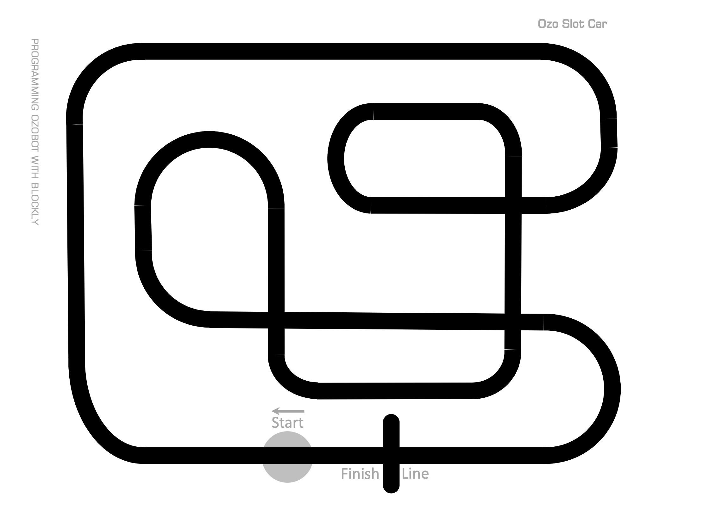
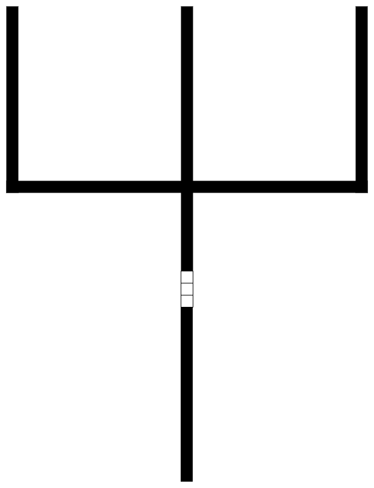
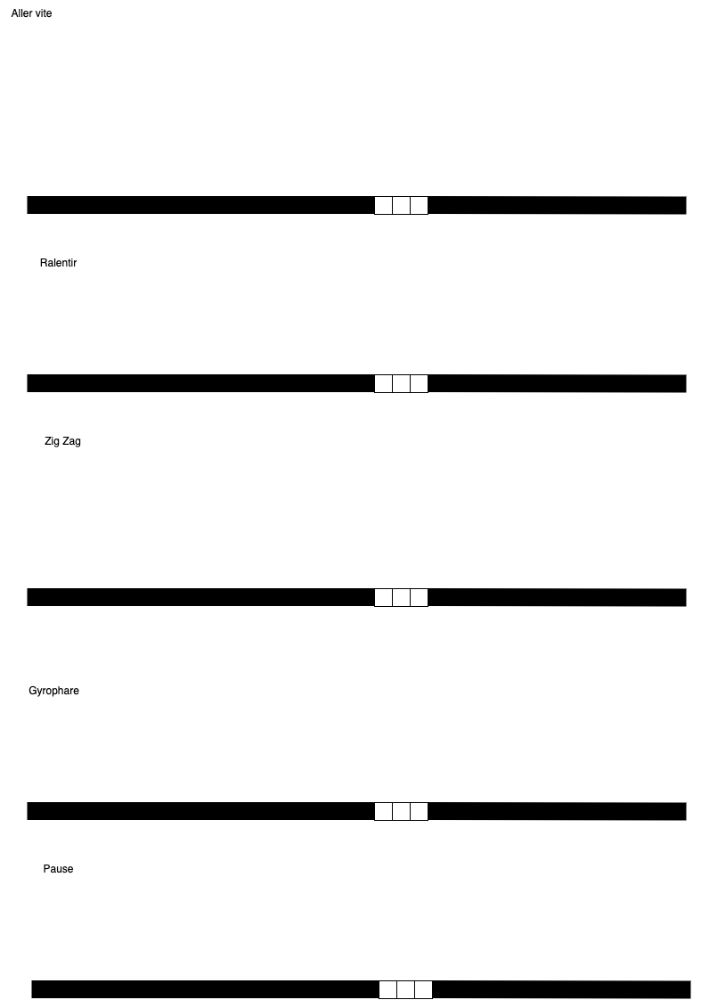
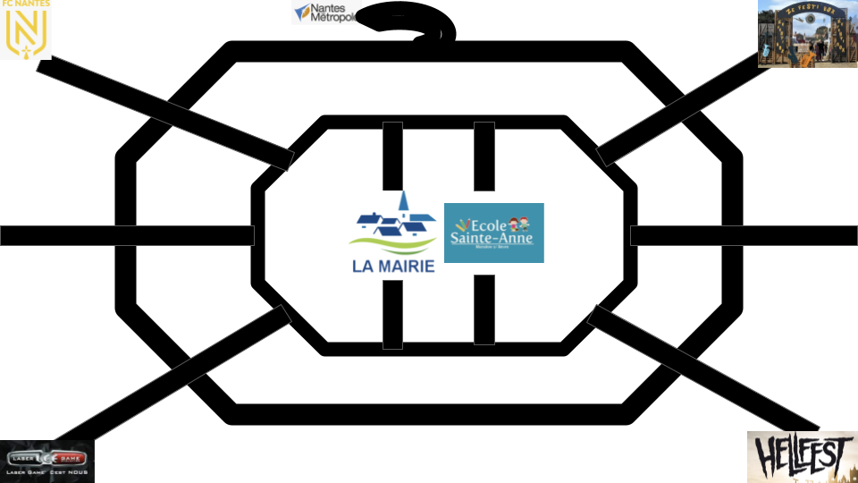

# Atelier

Je pars sur le principe que les enfants doivent découvrir ozobot,et que les écoles n'ont pas forcément de tablettes
ou que les tablettes sont réservées que pour certaines classes.
Par ailleurs, certains parents par choix ne disposent pas d'écran ou de tablettes.

Afin d'éviter que certains enfants se retrouvent totalement perdu, l'atelier ozobot se fera en mode déconnecté.

En pré requis:
* avoir au moins 3 ozobots
* du matériel de coloriage
* avoir préparé les ateliers

## But : 

Découvrir **Ozobot** et comment inter agir avec lui.

## Déroulé : 

### Groupe 

Construire des groupes de 4 élèves. 
Chaque élève devra manipuler le robot afin de comprendre le fonctionnement. A la fin de l'atelier, il sera demandé de faire
un bilan de l'exercice.
Cela permettrait aux enfants qui se sont perdus en cours de route de reprendre de l'information.

### Encadrement

Il est essentiel que les groupes ne soient pas isolés, un adulte devra aider les enfants dans la compréhension de l'exercice
et du résultat attendu.

### Atelier 1 : Présentation d'Ozobot (15 minutes) ou atelier dessin

L'objectif de cet atelier est de comprendre le fonctionnement du robot suiveur. 
Sans ligne, le robot ne peut rien faire.

#### Etape 1

Tracer des lignes (de couleurs, ou noires), des chemins, des labyrinthes 

Par exemple:

>***
>**Attendu**
>
> * Changement de couleur
> * Le robot n'a pas de logique dans le suivi des lignes 
>
>
>***

 
>**Attention**
> 
> * Les lignes doivent etre suffisament grosses
> * les courbes doivent être à angles doux.

### Atelier 2 : Introduction des instructions (20 minutes)

L'objectif de cet atelier est de comprendre que les code couleurs ont un sens
* vitesse
* direction
* mouvements spéciaux (zig-zag/ pause)

A la fin de la séance, il faudra récupérer des cartes de code couleur et de leur signification

#### Etude direction

#### Etude comportement

>**Attendu**
> Comprendre les instructions SI ... ALORS
> 

>**Attention**
>
> * Les lignes doivent être suffisamment grosses
> * les courbes doivent être à angles doux.

### Atelier 3 : Mise en application (20 à 30 minutes)

L'objectif est d'appliquer des codes couleurs à chaque situation

> Comprendre les instructins SI ... ALORS 

### Atelier 4 : Construction d'une carte dynamique

**WIP**

### Atelier 5 : Utilisation du logiciel Ozoblocky

**TODO**