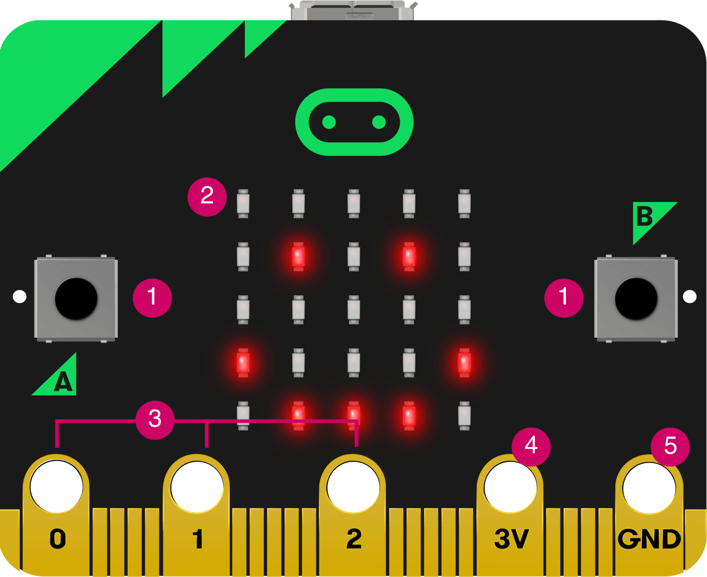
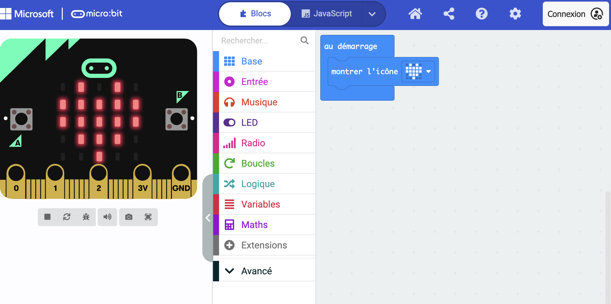
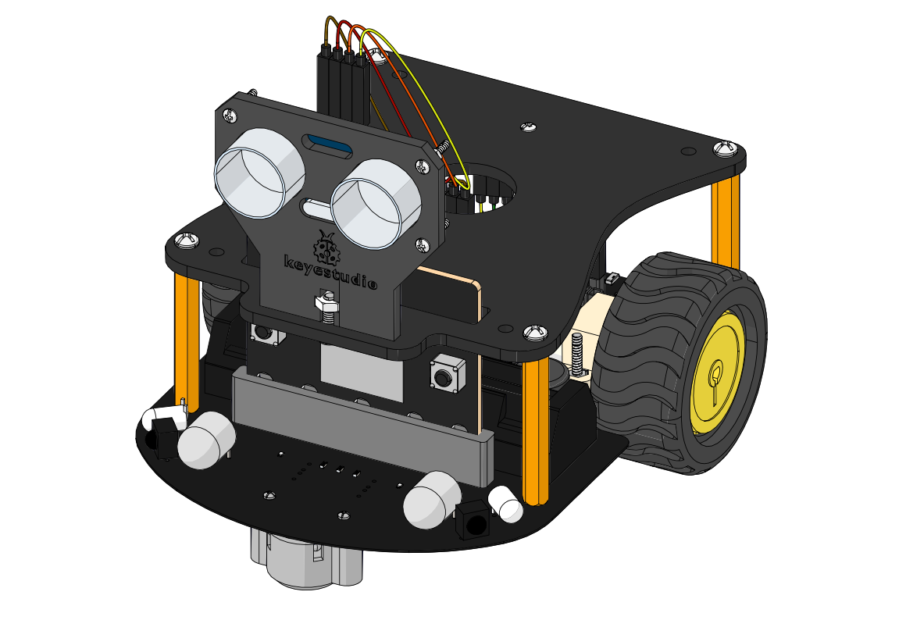

La **micro:bit** est une petite carte électronique créée pour t'apprendre à coder de manière amusante. Elle est faite pour **TOUT LE MONDE** !

| Caractéristique | Ce qu'elle fait |
| :--- | :--- |
| **Taille** | Elle tient dans la paume de ta main ! 🖐️ |
| **Affichage** | Elle a une grille de **25 lumières LED** (5x5) pour afficher des images, des lettres ou des nombres. |
| **Boutons** | Elle a **deux gros boutons** ($\mathbf{A}$ et $\mathbf{B}$) que tu peux utiliser comme des interrupteurs dans tes jeux. |
| **Capteurs** | Elle peut détecter le **mouvement** (comme un téléphone) et la **température** ! |
| **Connexions** | Elle a des **petites pointes dorées** en bas pour connecter des écouteurs, des moteurs ou d'autres lumières. |

## Les possibilités de la micro:bit ✨

La micro:bit n'est pas juste une carte ; elle est remplie de **super-pouvoirs** que tu peux contrôler en écrivant du code !

### 1. L'Écran Lumineux (Les **LED** 💡)

* **C'est quoi ?** Ce sont les 25 lumières rouges au centre.
* **Ce que tu peux faire :** Dessiner des cœurs, afficher des mots, ou créer une animation clignotante.
* **Comment la programmer ?** Tu dis à la micro:bit quelles lumières allumer (allumée = **ON**, éteinte = **OFF**).

### 2. Le Détecteur de Mouvement (L'**Accéléromètre** 🧭)

* **C'est quoi ?** Un capteur qui détecte si la carte **bouge**, si elle est **secouée**, ou si elle est **inclinée**.
* **Ce que tu peux faire :** Créer un dé à jouer numérique (secoue-la et elle affiche un chiffre !), ou un jeu où tu dois l'incliner.

### 3. La Boussole (Le **Magnétomètre** 🧭)

* **C'est quoi ?** Un capteur qui peut détecter les champs magnétiques, comme une boussole.
* **Ce que tu peux faire :** Afficher la direction du Nord (un peu magique, non ?).

### 4. La Connexion Sans Fil (**Radio** 📡)

* **C'est quoi ?** Un moyen pour la micro:bit de **parler** à une autre micro:bit sans fil, comme par magie !
* **Ce que tu peux faire :** Créer un jeu où deux joueurs s'envoient des messages secrets.

---

## Démarrer avec Microbit **MakeCode** 💻

[**MakeCode**](https://makecode.microbit.org/) est un site en ligne gratuit qui permet d'assembler des blocs de couleur pour réaliser différentes actions. Ce code pourra être exporté en fichier **.hex** pour les exporter vers les cartes.

### 💡 Un exemple simple :

Disons que tu veux que ta micro:bit affiche un cœur ❤️ quand tu appuies sur le bouton **A** :

* Tu prends le **bloc "quand le bouton A est pressé"** (dans la catégorie *Entrée*).
* Tu y insères le **bloc "afficher icône cœur"** (dans la catégorie *Base*).

---

## Quelques idées de projets 💡

- Faire clignoter des animaux (de https://microbit.org/fr/projects/make-it-code-it/flashing-emotions/).

- Programmer un dé (de https://microbit.org/fr/projects/make-it-code-it/dice/).

- Microbit & Scratch (de https://microbit.org/fr/projects/make-it-code-it/scratch-jumping-cat/)

- Niveau à bulle (https://microbit.org/fr/projects/make-it-code-it/spirit-level/)

- Minuteur avec son une fois terminé
 

## Pour aller plus loin 🚀

Les cartes microbit peuvent être utilisées dans des robots tels que celui-ci : 

## Références

- https://docs.keyestudio.com/projects/KS0426/en/latest/makecode/makecode.html

- https://wiki.keyestudio.com/KS0223_Keyestudio_Smart_Car_Kit_for_Raspberry_Pi#Resourece

- https://www.amazon.fr/KEYESTUDIO-BBC-Micor-d%C3%A9marrage-lexception/dp/B09V781TV1/ref=ast_sto_dp_puis
