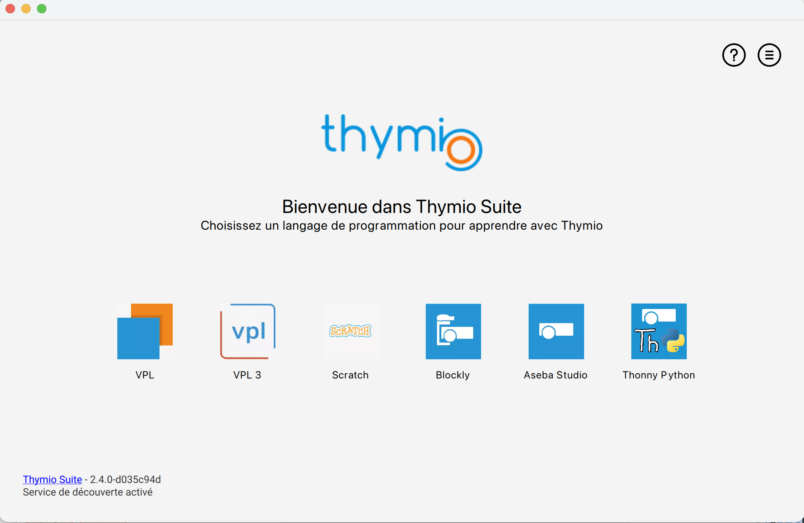

# Atelier Thymio

## But

Découvrir la programmation avec Thymio.

## Présentation

Thymio Suite vient avec plusieurs outils pour programmer le robot : 

- VPL
- VPL3
- Scratch
- Blockly
- Aseba Studio
- Thonny Python

## Exercices

Plusieurs version des exercices sont disponibles :

- [Retrouvez les exercices avec VPL 2](vpl2/readme.md)
- [Retrouvez les exercices avec VPL 3](vpl3/README.md)
