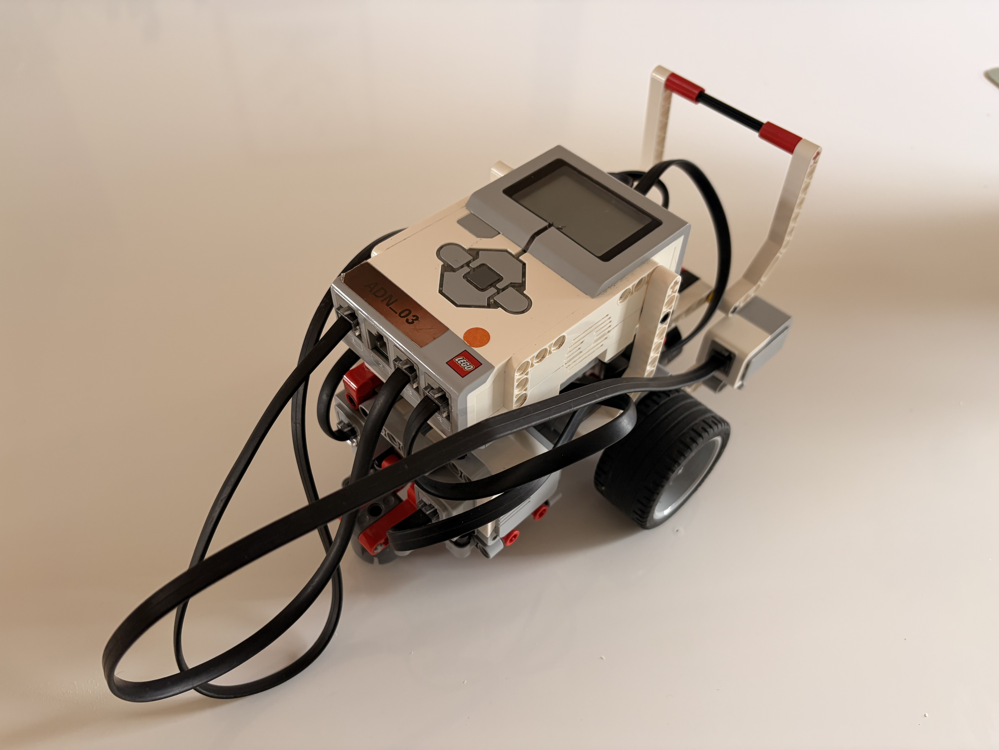

# Ateliers Lego Mindstorms

Les ateliers avec les robots Mindstorms peuvent se faire de deux façons :
- uniquement avec les robots et leur interface de programmation intégrée
- avec les robots et le logiciel [Lego Mindstorms EV3](https://education.lego.com/fr-fr/downloads/mindstorms-ev3/software/).

ℹ️ [Ce document](https://docs.google.com/presentation/d/12L65HymgkmR39X5Y2Q-siFtsokvupyEyfPQk01tfJ28/edit?slide=id.g386dbf18112_0_33#slide=id.g386dbf18112_0_33) (accessible uniquement pour les personnes de Zenika) contient les versions originales des exercices présents dans ce répertoire.

## Programmation avec l'interface intégrée

Voici les 6 exercices disponibles pour programmer directement depuis l'interface intégrée du robot :

  
👀 Exercice 1

  <iframe src="./dev-interface/Exercice1.pdf" width="100%" height="600px" style="margin-top: 10px; border: 1px solid var(--vp-c-divider); border-radius: 8px;"></iframe>

  
👀 Exercice 2

  <iframe src="./dev-interface/Exercice2.pdf" width="100%" height="600px" style="margin-top: 10px; border: 1px solid var(--vp-c-divider); border-radius: 8px;"></iframe>

  
👀 Exercice 3

  <iframe src="./dev-interface/Exercice3.pdf" width="100%" height="600px" style="margin-top: 10px; border: 1px solid var(--vp-c-divider); border-radius: 8px;"></iframe>

  
👀 Exercice 4

  <iframe src="./dev-interface/Exercice4.pdf" width="100%" height="600px" style="margin-top: 10px; border: 1px solid var(--vp-c-divider); border-radius: 8px;"></iframe>

  
👀 Exercice 5

  <iframe src="./dev-interface/Exercice5.pdf" width="100%" height="600px" style="margin-top: 10px; border: 1px solid var(--vp-c-divider); border-radius: 8px;"></iframe>

  
👀 Exercice 6

  <iframe src="./dev-interface/Exercice6.pdf" width="100%" height="600px" style="margin-top: 10px; border: 1px solid var(--vp-c-divider); border-radius: 8px;"></iframe>

 

> [!TIP]
> Vous pouvez également les télécharger ou les ouvrir en plein écran via ces liens directs : [Ex 1](./dev-interface/Exercice1.pdf), [Ex 2](./dev-interface/Exercice2.pdf), [Ex 3](./dev-interface/Exercice3.pdf), [Ex 4](./dev-interface/Exercice4.pdf), [Ex 5](./dev-interface/Exercice5.pdf), [Ex 6](./dev-interface/Exercice6.pdf).

## Programmation avec le logiciel Lego Mindstorms EV3

🚧 A compléter

### Installation du logiciel Lego Mindstorms EV3

Le logiciel Lego Mindstorms EV3 est disponible sur [le site Education de Lego](https://education.lego.com/fr-fr/downloads/mindstorms-ev3/software/).

Après l'avoir installé, ... 

🚧 Schéma 

### Exercices 

