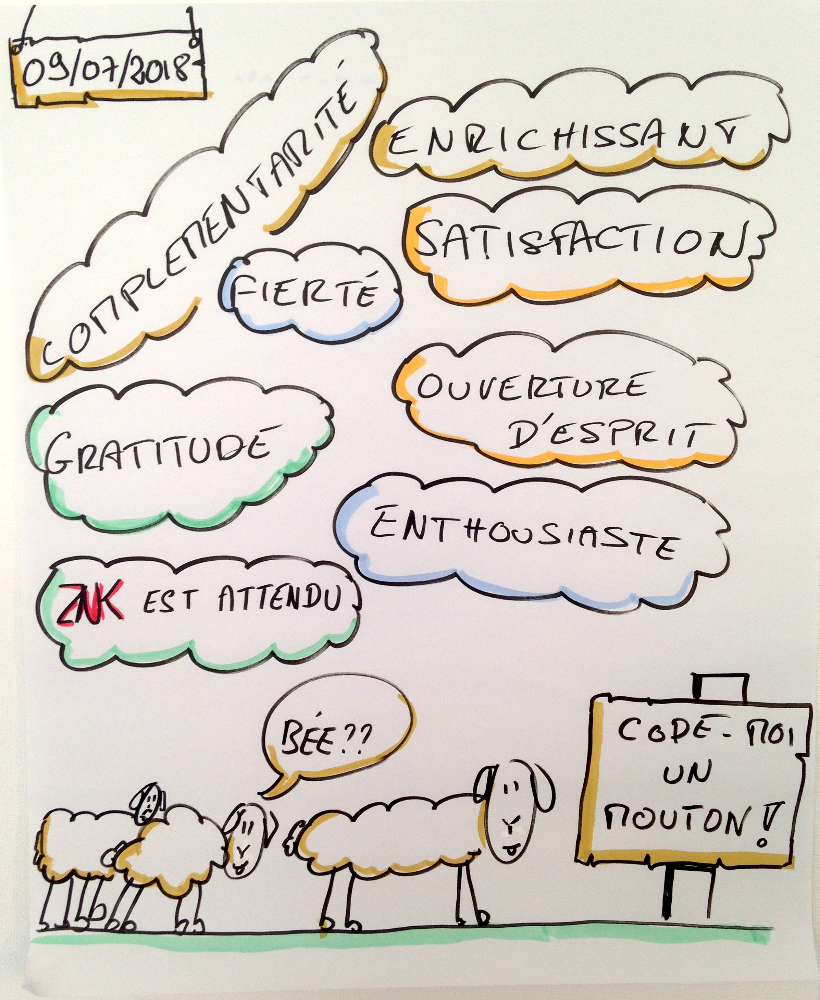

# How to

## 1. Construire une équipe des personnes intéressées

L’équipe doit aussi définir ce que veulent faire les personnes.

Outre l’aspect formation il y a d’autres rôles lié à l’organisation. Il doit y avoir dans l’équipe une ou plusieurs personnes responsable de l’organisation et du bon déroulement des rencontres et des ateliers. Ce peut être un rôle partager et tournant qui ne doit pas être vacant.

## 2. Pour les évènements dans les écoles 

### 1 . Sélectionner une (ou plus) écoles primaires

Les écoles les plus simples à contacter sont celles où vous avez vos enfants car vous connaissez des membres de l’équipe pédagogique.

Demandez aux personnes intéressées par la démarche qui ont des enfants en primaire et seraient motivées pour proposer cela dans leurs écoles

### 2. Prendre contact avec la directrice (ou le directeur) de l’école pour expliquer la démarche

Le parent ayant un/des enfant(s) scolarisé(s) dans cette école peut profiter d’une sortie ou rentré d’école pour l’aborder ou prendre rendez vous.

Expliquer la démarche, le pourquoi vous faites cela. Lui proposer de lui envoyer un [mail](emails/email_prise_contact_ecole.md) qui formalise cela.

Il est important de savoir que certaines entreprises veulent accéder aux enfants dans l’objectif de faire du prosélytisme, ce n’est absolument pas notre objectif et il faut être clair sur ce point : nous ne vendons rien, ne représentons aucun [lobby](http://www.liberation.fr/france/2016/11/14/le-lobby-de-la-viande-s-invite-a-l-ecole_1528280), ne prendrons pas de photo d’enfants… C’est du bénévolat avec pour seul objectif de faire en sorte que les enfants découvrent le code et sache que c’est accessible quelque soit le genre et l’origine.

### 3. Envoyer le mail type d’explication à la directrice (ou au directeur)

Ce mail est à personnaliser en fonction du contexte. Il est à envoyer rapidement suite au premier contact.

Vous pouvez avoir un non à cette étape, ce n’est pas grave, la/au directrice/eur a d'excellentes raisons de ne pas donner suite à cette démarche. Peut être d’autres écoles seront intéressées.

### 4. [OPTIONNEL] Re-contacter la directrice (ou le directeur) en cas de non réponse

Si vous n’avez pas eu de retour d’ici une dizaine de jours recontacter la directrice (ou le directeur) pour savoir si il a pu lire votre mail et si il a des questions ou besoin d’une explication plus détaillée

### 5. [OPTIONNEL] Expliquer oralement les objectifs et la démarche

En fonction des retours la directrice (ou le directeur) peut avoir des questions avant de vous faire rencontrer l’équipe pédagogique.

### 6. Première rencontre avec l’équipe pédagogique pour partager la démarche, répondre aux questions et parler plus en détail du déroulement des ateliers

L’équipe pédagogique est un acteur clef dans le bon déroulement des ateliers et c’est aussi des personnes à former pour qu’ils deviennent autonomes pour reproduire ces ateliers sans vous les autres années. En outres il est normal qu’ils aient des questions et des inquiétudes.

Cette rencontre doit permettre de :

- partager le pourquoi vous faites cela
- répondre aux interrogations de l’équipe pédagogique
- partager la nécessité de l’implications de l’équipe pédagogique
- expliquer le modèle théorique (½ groupe avec la présence du professeur) et commencer à réfléchir sur comment le mettre en oeuvre avec les différentes contraintes de chacun
- identifier les besoins en matériel (salle, pc, Scratch, Thymio, vidéo projecteur…)

### 7. [OPTIONNEL] Monter avec l’équipe enseignante le dossier pédagogique

Selon le contexte un dossier pédagogique peut être nécessaire. Nous n'avons pas pour l’instant d'élément à partager sur ce point.

### 8. [OPTIONNEL] Organiser un atelier de présentation du contenu avec les enseignants. (Présentation de Thymio + Scratch)

Si le planning le permet il est bien de faire un atelier présentant plus en détail les ateliers afin que tous puissent commencer à se familiariser avec le matériel et le contenu des ateliers. Cela peut permettre aussi d’anticiper certains problèmes (ex : mauvaise version de Scratch).

### 9. Valider entre intervenants les disponibilités de chacun

L’objectif est de connaître la capacité d’intervention des différents consultants et d’anticiper bien en avance les éventuels aménagements à réaliser dans l’emploi du temps de chacun.

### 10. Préparer entre intervenants les ateliers

Par intervenants nous entendons :

- animateurs des ateliers & facilitateurs zenika
- institut.rices.eurs & directeur de l’école (facilitateur)

L’objectif de cette phase est de s’aligner

- sur le contenue des ateliers et leur déroulement
- le planning des ateliers
- la taille du groupe
- le rôle des participants

Organisation des ateliers :

Travail en binôme, en salle d’informatique.

Chaque classe suivra 2 ateliers. Si les enfants ont vu les Thymio commencez par cela (ils seront trop pressés de les utiliser). Dans le cas contraire le premier atelier peut être l'atelier Scratch et le second l'atelier avec des Thymio.

Un atelier est de environ 1h45. Nous ferons les ateliers le matin et il y aura 2 ateliers par matinée.

Les classes seront divisées en ½ groupes, un ½ groupe sera en atelier, l’autre sera répartie dans les autres classes ou en classe avec le directeur.

Sur une matiné nous ferons donc 2 fois le même type d’atelier avec une même classe en ½ groupe

Pour un ½ groupe spécifique l’on aura 2 ateliers espacés d’une semaine ou plus en fonction des agendas de l’école : 1 Scratch et 1 Thymio

| Classe - Groupe |  Matinée 1 |  Matinée 2 |  Matinée  3| ... |
|--|--|--|--|--|
| 1 - A  | **8:30 à 10:00 => Atelier 1** <br/> 10:15 à 11:45 => Autre classe  |  | 8:30 à 10:00 => Autre classe <br/> **10:15 à 11:45 => Atelier 2** | ... |
| 1 - B  | 8:30 à 10:00 => Autre classe <br/> **10:15 à 11:45 => Atelier 1** |  | **8:30 à 10:00 => Atelier 2** <br/> 10:15 à 11:45 => Autre classe | ... |
| 2 - A  |  | **8:30 à 10:00 => Atelier 1** <br/> 10:15 à 11:45 => Autre classe |  | ... |
| 2 - B  |  | 8:30 à 10:00 => Autre classe <br/> **10:15 à 11:45 => Atelier 1** |  | ... |
| ... | ... | ... | ... | ... |

Le premier atelier : l’atelier Scratch sera réalisé avec 2 Zenika (1 référent et un débutant dans l’exercice) et l’enseignante de la classe.

Le second atelier : l’atelier Thymio sera réalisé avec 1 Zenika et l’enseignante de la classe

A titre d'exemple voici les dates des ateliers réalisés dans la première édition :

- Mercredi 2 mai
- Lundi 14 mai
- Mardi 22 mai
- Lundi 28 mai
- Lundi 4 juin
- Lundi 11 juin


## 2 bis. Pour les évènements dans les agences Zenika 

### 1. Préparer un fichier pour noter les inscriptions

Un simple tableau Google Sheet peut-être déposé dans le Drive partagé de votre agence avec le nom/prénom de chaque enfant, leur date de naissance, le client éventuellement pour essayer d'équilibrer.


### 2. Envoyer un email / message chez nos clients

Voici un exemple de mail :

```
Nous organisons le xxx à l'agence Zenika de xxx un atelier de promotion du développement auprès des enfants.

Cette session, encadré par 2 adultes, durera 2h et sera l'occasion pour une dizaine d'enfants de 8 à 14 ans de découvrir ou re découvrir le développement informatique en s'amusant avec des robots.

L'atelier se fera sans les personnes accompagnant pour éviter toute distraction 😁.
Le matériel est fourni par Zenika.

Déroulé de l'après-midi :
- 13h30 - 14h, accueil des enfants
- 14h -> 16h : atelier
- 16h, goûter offert par Zenika

Si cela intéresse du monde, il me faudrait juste les nom/prénoms et date de naissance des enfants.

Bien sur, ces données ne servent qu'à l'organisation de l'évènement.
```

## 3. Réaliser les ateliers

Voir [atelier Thymio](ateliers/atelier_thymio.md) et [atelier Scratch](ateliers/atelier_scratch.md)

## 4. Entre chaque ateliers faire une synthèse de ce qui c’est passé

Ceci afin de partager ces moments et améliorer les prochains ateliers

## 14. A la fin des ateliers faire une rétrospective (avec les enseignants et les intervenants dans le cadre d'évènements dans les écoles)

Ce point est important pour partager nos succès et points d’améliorations, mais aussi se projeter sur la suite.

Il est nécessaire que cette rétrospective soit animé par un coatch agile.

La synthèse de notre première rétrospective en image :
